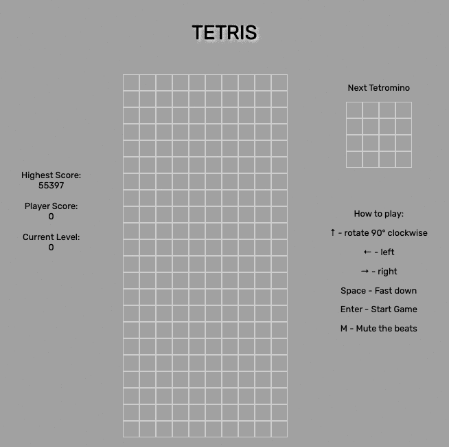
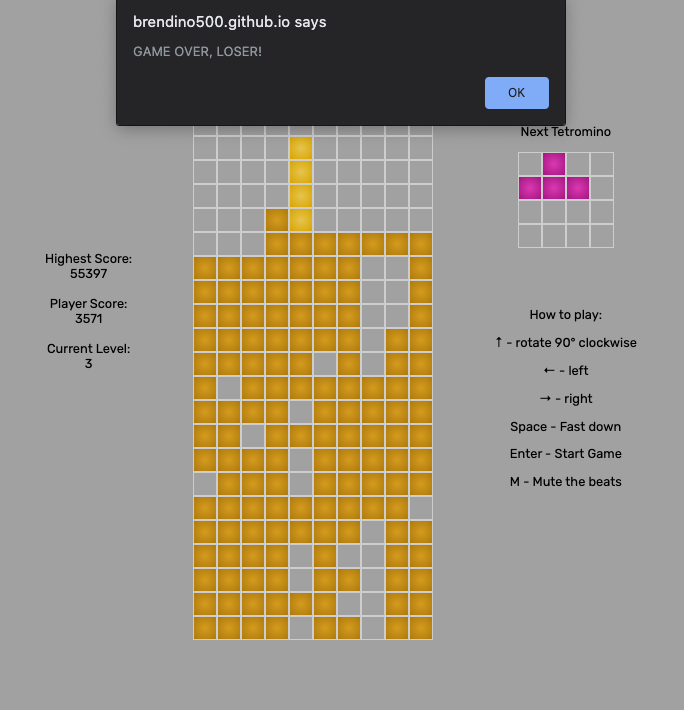
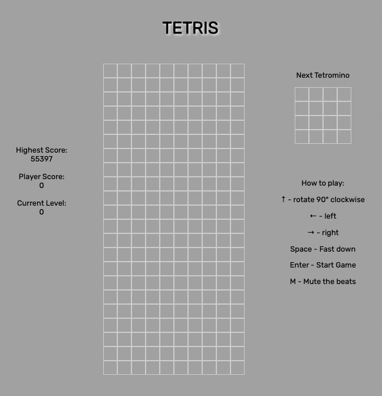

# General Assembly SEI-49 | Project 1 - Tetris

​

## :rocket: Overview

​
This was my first project at General Assembly Software Engineering Immersive course. This was a project created from vanilla JavaScript and it was the first project I had created and deployed. I chose Tetris as it was a game I loved playing as a child. **I also wanted to develop a game which had challenging game logic.**

Tetris is a tile matching videogame made in 1984 by Alexey Pajitov, a Russian software engineer. The aim of the game is to clear as many full rows from a grid as possible by randomly selected falling tetrominos. As the player increases the score, the speed of the falling tetromino increases therefore making the game gradually harder.

## :mantelpiece_clock: Timeframe

7 days

## Technologies Used

- HTML5
- CSS
- JavaScript (ES6)
- Git
- GitHub

---

## :technologist: Technical Requirements

- **The game should stop if a Tetrimino fills the highest row of the game board**
- The player should be **able to rotate each Tetrimino about its own axis**
- If a **line is completed it should be removed** and the pieces above should take its place
- **Speed increases** over time
- Persistent **leaderboard using `localStorage`**
- Include separate HTML / CSS / JavaScript files
- Use Javascript for DOM manipulation
- Use semantic markup for HTML and CSS (adhere to best practices)

---

## :joystick: Game Instructions

- **Enter** to start the game
- :arrow_up: Rotate 90° clockwise
- :arrow_right: Move right
- :arrow_left: Move left
- :arrow_down: Move down one square
- **Space Bar** for a fast down
- **M** key to mute the music

**Game Over**

- When the game is finished the player will see a window alert notifying them that the game is over.
  

---

## :wrench: Process

- After **three weeks of learning the basics of HTML, CSS and JS**, this seemed like a gargantuan task. First I made a **grid of divs** as my canvas for the game. After that, I made all the **tetrominos as objects which would be manipulated**. I put these into a grid with numbers which **helped me visualise** how they would appear on the canvas.

  

- Once that was done, there was a lot of logic to implement. **Checks would have to be made** if the tetromino hits the **side of the canvas**, if the tetromino **can rotate**, if the tetromino has **any form of barriers** and if the tetromino can **fix it's position**.

- This involved a lot of **maths and logic, which was a very tough mental challenge** as this was manipulated with the tetrominos as objects.
  

---

## :muscle: Challenges

- I wanted to recreate the **mini grid featuring the next random tetromino** that will be played. The challenge was to place that tetromino in a separate grid and use that shape to add to the main playing grid.

- I also wanted the use the **fast down** functionality which the original game has as well.

## :trophy: Wins

- I wanted to implement the **original Sega scoring system** for Tetris. The numbers were taken from [here](https://tetris.wiki/Scoring).
  - **As each tetromino falls and enters a new row, 1 point will be added** to the player score.
  - If the player chooses to 'fast down' the tetromino, the **points the player would have scored is automatically added** once the tetromino is fixed.
  - As the **level changes, so does the point system and speed.**
  - **Increasing the speed as the player moves up levels.**

 
Example of scoring system.

---

## :nerd_face: Comments

- The biggest thing I've learnt is that coding a game is hard! I really didn't want a game with bugs and I wanted the game to **feel like the original**.

- When **I was in doubt, I put things into functions**, which for me at the time, made a lot of sense. I feel like my code is very readable (please let me know if I'm wrong!) and I believe my displine here **helped me a lot for subsequent projects**.

  
    

- The player can never win as Tetris **always** wins.
